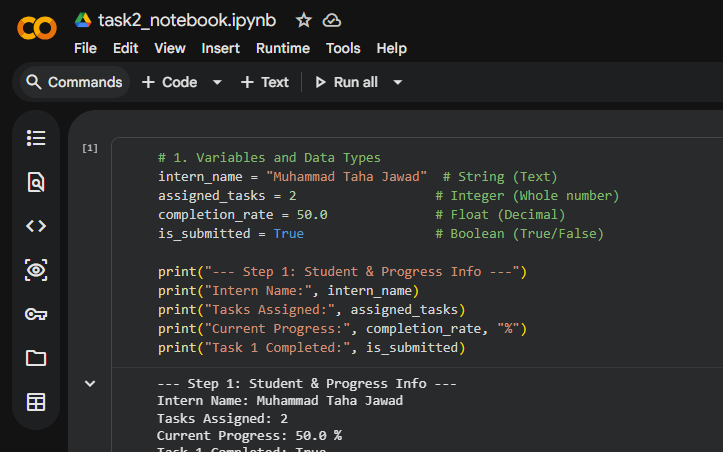
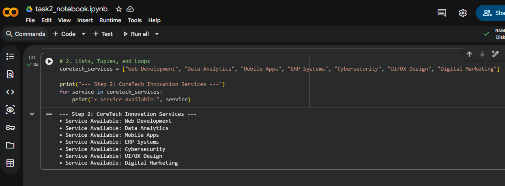
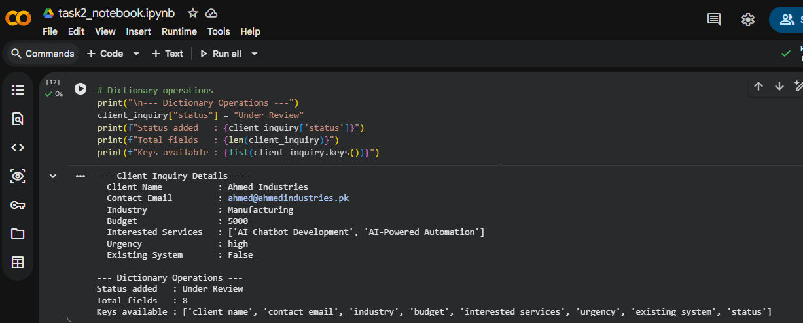
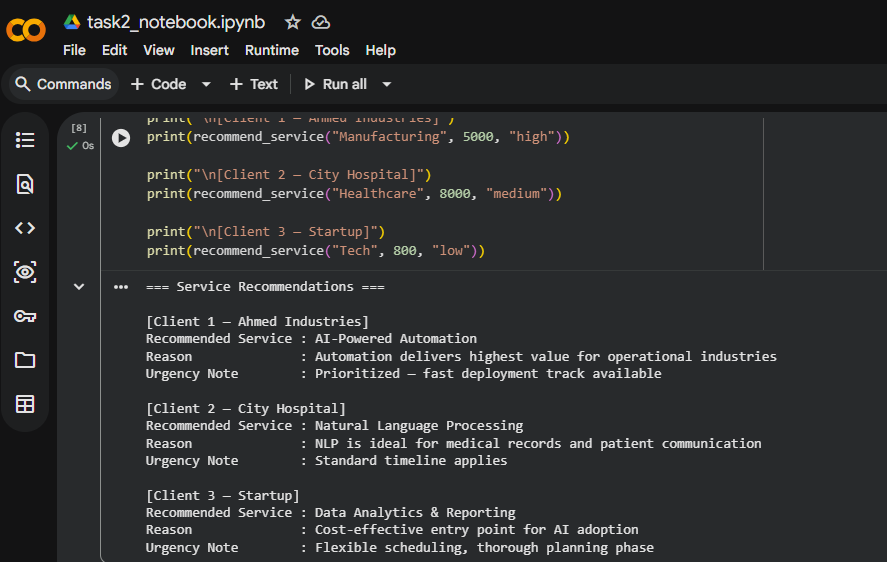
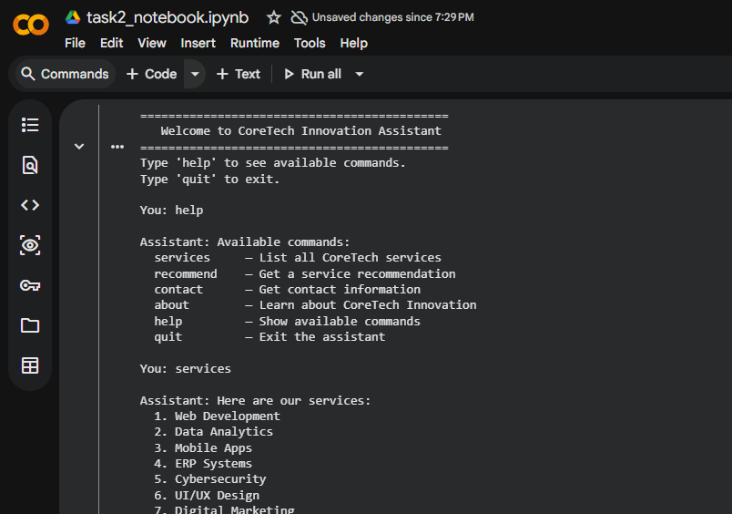

> ⚠️ # **Note:** Due to a global GitHub rendering timeout issue, the `.ipynb` notebook file may display an "Unable to render code block" error above. Please use the official **Open in Colab** badge below to run the interactive code, or view the execution screenshots provided in this document.

> 
# Task 2: Python Basics for AI Applications

**Intern Name:** Muhammad Taha Jawad  
**Tools Used:** Python 3, Google Colab, GitHub  

## 📋 Project Summary
This folder contains my basic Python practice required for AI applications, including working with variables, listing services, managing client data structures, and building a simple logic helper.

## 🛠️ Execution & Output Verification

### 1. Variables and Data Types

### 2. CoreTech Services List & Loop

### 3. Client Inquiry Dictionary

### 4. Service Recommendation Function

### 5. Interactive Assistant Command-Line

