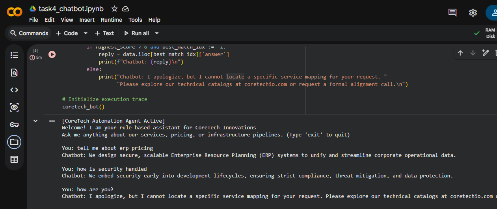

> ⚠️ **Note:** Due to standard GitHub rendering timeouts handling heavy JSON metadata structures, the `.ipynb` notebook file view may occasionally flash a warning message above. Please use the official structural **Open in Colab** badge below to view code execution matrices directly, or inspect the verification traces in this document.

# Task 4: CoreTech FAQ Dataset and Rule-Based Chatbot

**Intern Name:** Muhammad Taha Jawad  
**Target Organization:** CoreTech Innovations ([coretechio.com](https://coretechio.com))  
**Tools Used:** Python 3, Pandas, Regular Expressions, Git, Google Colab  

---

## 📋 Operational Project Summary
This module deploys a functional rule-based chatbot architecture designed to parsing user intent and automatically routing clients to core corporate answers. The setup includes an programmatically-generated dataset mapping company services, pipelines, and constraints.

### Key Architectural Enhancements
* **Token Intersection Matching:** Instead of relying on rigid, breakable string matching, the engine normalizes user input and calculates a token intersection weight score against keyword matrices.
* **Granular Exceptions Handling:** Gracefully catches missing dependencies and routes unmapped client phrases to a specific corporate advisory fallback loop.

---

## 📊 Dataset Distribution Verification (`coretech_faq.csv`)
The dataset context contains exactly 25 comprehensive categorical records:
* **Core Services Covered:** Web Development, Mobile Apps, Enterprise ERP Systems, UI/UX Design, Cybersecurity, Digital Marketing.
* **Trust Elements Included:** Target domain authentication, 94% retention proofing benchmarks, post-launch support windows.

---

## 🛠️ Execution & Chatbot Interface Verification
Below is the verification trace showing the rule-based keyword routing engine handling inputs and user exits correctly:

