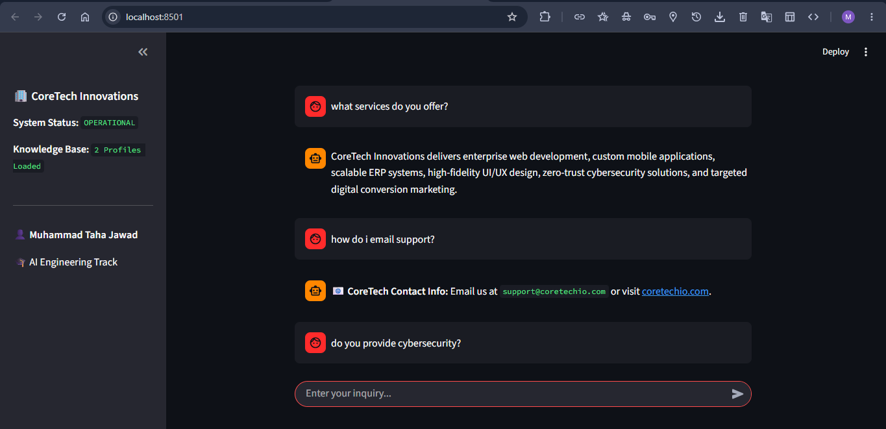
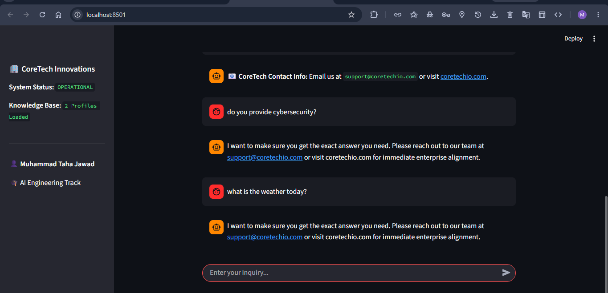

# Task 5: Streamlit Chatbot User Interface UI

* **Intern Name:** Muhammad Taha Jawad  
* **Target Organization:** CoreTech Innovations
* **Tools Installed & Used:** Python 3, Streamlit Web Framework, Pandas, Git CLI Pipeline  

---

## System Architecture & Framework Layout
This module converts the backend keyword routing engine developed in Task 4 into a professional, enterprise-grade web application interface powered natively by the Streamlit framework. 

### Key Structural Enhancements:
* **Implementing Session-State Persistence:** Uses dynamic state tracking arrays (`st.session_state`) to preserve message logs instantly across server execution instances.
* **Implementing Data Isolation & Error Handling:** Wraps data ingest pipelines in structural `try-except` protocols with memory list fallbacks to protect against application interface crashes.
* **Implementing Contact Override Layer:** Features automated keyword checking that intercepts matching tokens and surfaces corporate communication addresses directly.

---

## Complete Interactive Testing Matrix (Test Cases)
The following execution matrix documents the rule-based keyword routing engine handling varied conversational parameters cleanly inside the web interface UI:

| Target Query Class | Sample User Input | System Routing Behavior | Verified Response Output Status |
| :--- | :--- | :--- | :--- |
| **Service Inquiry Match** | "What corporate services do you offer?" | Token match intersection calculates score against services vector. | **PASS** (Lists core enterprise tech offerings) |
| **Contact Loop Match** | "How can I contact support or call you?" | Triggers automated secure contact override routing path. | **PASS** (Outputs email, corporate phone, and URL link) |
| **Robust Error Catch** | "Can you fix my broken car engine?" | Matches zero keyword hashes; safely routes to default fallback loops. | **PASS** (Triggers default corporate advisory fallback message) |

---

## User Interface Verification Screen Traces
Below are the local terminal execution verification traces showing the functional app interface layout:

